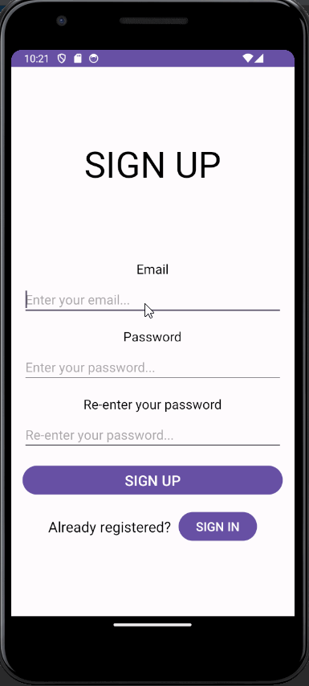

# Selfie a Day App

Images app where users can shake the phone to open a selfie camera to take pictures which can be viewed, deleted.

## Functionality 

The following **required** functionality is completed:

* [ ] User will be navigated to a selfie screen when the phone is shook
* [ ] Image user takes will be saved in firebase realtime database.
* [ ] User can click on an image and view it in fullscreen where they can delete it if they want.
* [ ] User can sign up and sign in.
* [ ] Saved images are displayed using Glide.

The following **extensions** are implemented:

* Firebase
* Shake Detection
* RecyclerView
* Glide

## Video Walkthrough

Here's a walkthrough of the program:

GIF created with [LiceCap](http://www.cockos.com/licecap/).

## Notes

It was difficult to configure firebase to work with images as opposed to notes like in the last project we did. Other than that it was fun to make this app.

## License

    Copyright [2023] [Tip Browne, Ethan Deporter]

    Licensed under the Apache License, Version 2.0 (the "License");
    you may not use this file except in compliance with the License.
    You may obtain a copy of the License at

        http://www.apache.org/licenses/LICENSE-2.0

    Unless required by applicable law or agreed to in writing, software
    distributed under the License is distributed on an "AS IS" BASIS,
    WITHOUT WARRANTIES OR CONDITIONS OF ANY KIND, either express or implied.
    See the License for the specific language governing permissions and
    limitations under the License.
